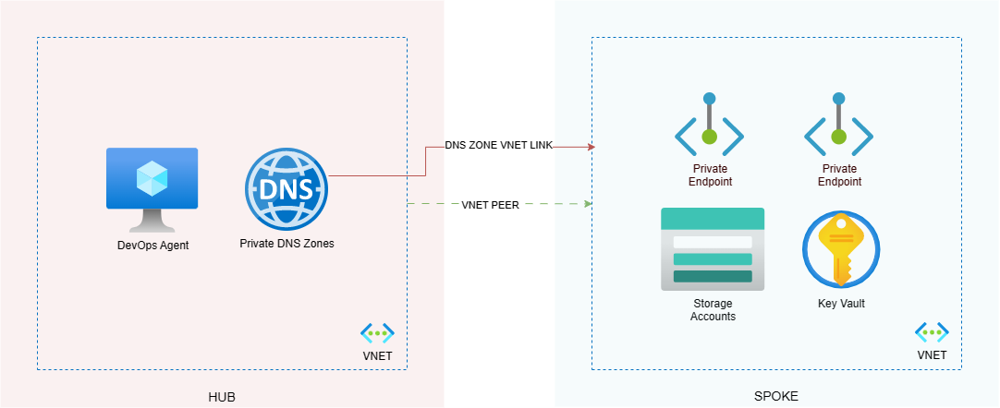

# Terraform Private Storage

Please review the corresponding blog post for this, [here](https://clouddevdan.co.uk/private-endpoints-and-terraform-a-tale-of-time).

The Terraform code within this repo consists of two folders:

- **private-storage** - demonstrates the errors detailed in the blog post.
- **private-storage-fix** - is a fixed version of the code.

The Terraform config will:
- Deploy the spoke resource group
- Deploy the spoke VNET
- Peer the (referenced) hub and spoke VNETs
- Link the spoke VNET to the (referenced) hub Private DNS Zones
- Deploy a Key Vault and Private Endpoint
- Deploy X number of Storage Accounts (X = resource_count in ```terraform.tfvars```). Each with a Private Endpoint.
- Create multiple containers, tables and queues within each Storage Account.
- Add each Storage Account primary key as a secret is the Key Vault (created earlier).

**Solution diagram**:



Note that the code does not deploy the hub resources, such as the VNET, Private DNS Zones or Azure VM. If you intend to run this code yourself, create these resources and update the references to them in the root ```main.tf``` file.

You will also need to create a ```terraform.tfvars``` file that contains the below:

```
####################
# Common Variables #
####################
app_name       = "clouddevdan"
location       = "UK South"
resource_count = 4

##################
# Authentication #
##################
azure-subscription-id = "XXX"
azure-client-id       = "XXX"
azure-client-secret   = "XXX"
azure-tenant-id       = "XXX"
```